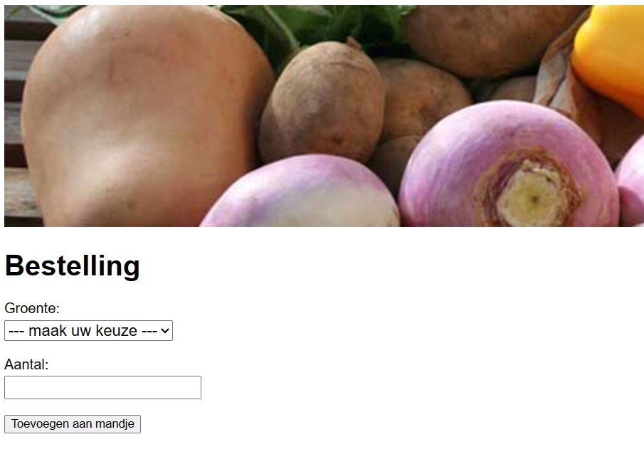

# Groentenwinkel Webpagina

Dit is een eenvoudige webpagina voor een virtuele groentenwinkel. Gebruikers kunnen groenten bestellen door een groente te kiezen uit een lijst en het gewenste aantal in te voeren. De pagina maakt gebruik van HTML en CSS.

## Functionaliteiten

- **Groentenlijst**: De gebruiker kan een groente kiezen uit een vooraf gedefinieerde lijst (gegevens in `groenten.json`).
- **Aantal**: De gebruiker voert het gewenste aantal in.
- **Toevoegen aan bestelling**: Na het kiezen van een groente en invoeren van het aantal, kan de gebruiker op een knop drukken om de groente aan de bestelling toe te voegen.
- **Foutmeldingen**: Er worden foutmeldingen weergegeven als de gebruiker geen groente heeft gekozen of een ongeldig aantal heeft ingevoerd.
- **Tabel met bestelling**: De bestelling wordt weergegeven in een tabel met kolommen voor groente, aantal en prijs.
- **Totaalbedrag**: Het totaal te betalen bedrag wordt onderaan de tabel weergegeven.

## Gebruik

1. Clone deze repository naar je lokale machine.
2. Open het `groentenwinkel.html` bestand in je browser.
3. Kies een groente, voer het aantal in en druk op de knop om de bestelling toe te voegen.

## Voorbeeld



## JSON-gegevens (groenten.json)

```json
[
  {
        "naam": "aardappelen",
        "prijs": 0.95,
        "eenheid": "kg"
  },
  {
        "naam": "avocado",
        "prijs": 2.69,
        "eenheid": "stuk"
  },
  {
        "naam": "bloemkool",
        "prijs": 1.93,
        "eenheid": "stuk"
  },
  ...
]
```
